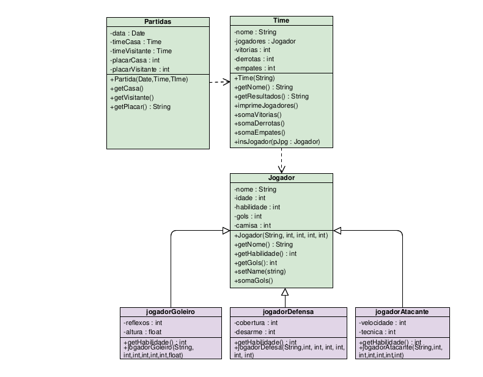

# Projeto_Football-League

Projeto desenvolvido por mim, [Alliquison Matias](https://github.com/Ally-Matias) e [João Paulo](https://github.com/joaopaulonr).
##

Projeto idealizado para a implementação de uma estrutura de classes que permita armazenar e manipular dados de jogadores,times e jogos. Essa estrutura será utilizada para montar um protótipo de jogo de simulação estilo
“Football Manager”, no qual a pessoa que está jogando assume o papel de um técnico, escalando o time e um software simula os jogos entre times.

Existem vários jogos derivados do “Football Manager” como o Elifoot, Brasfoot e Championship Manager. Todos com o mesmo estilo.
Nessa parte 1 nos preocupamos APENAS com a implementação orientada a objetos que envolve cada entidade do problema.

##

## Diagrama UML

